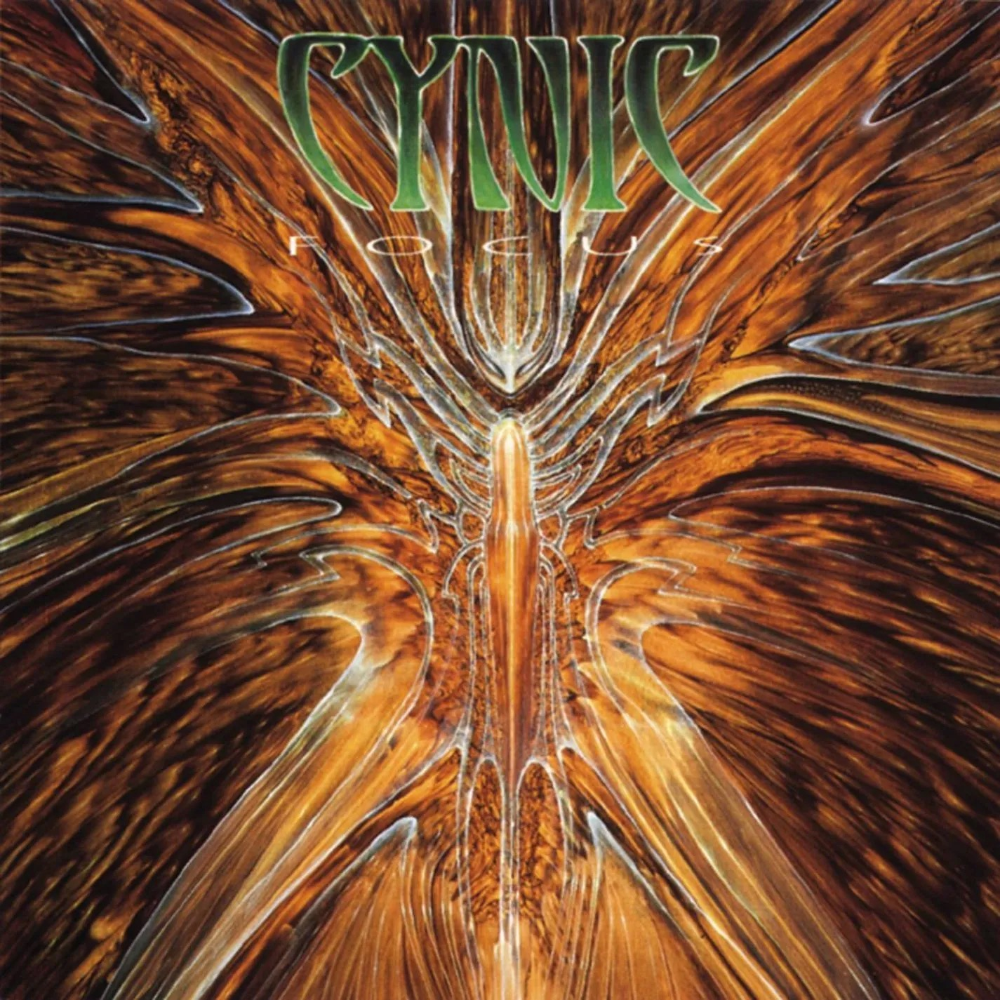

## Focus -cynic

先搬一段我个人认为写的相当优秀的qq音乐简介：

>“金属史上的传奇性乐团Cynic，在发表了经典作品Focus后，旋即宣告解散，这样的结局除了令金属子民们相当地惋惜之外，却也因而更造就了这张作品的传奇地位，同时也成为了乐迷们口耳相传的不朽作品。这是一张1993年发行的专辑，作品中可以听到大量Jazz、Progressive与Death Metal的音乐元素，非常巧妙的完美结合，这是一张很技巧、很fusion的好听专辑，其制作人美国颇富盛名的Scott Burns，Death Metal祖师爷级乐团Death若乾名作即出自其手，而Cynic两位团员Paul Masvidal、Sean Reinert，亦曾参与Death经典专辑Human的演出。在Focus中，也加入了少量女声以及键盘，增添音乐丰富性，每位乐手的高超技巧更为其卖点，那双吉他真的好犀利，riffs&solo真令人喜爱。主唱清、死腔巧妙切换，时而运用特效的嗓音真是非常的特别。一张值得强力鼓吹给各式Metal Fans甚至是Jazz Fans的精彩好碟。”

通过简介不难看出专辑本身的硬实力和其成员团队的雄厚背景。其实此专我很早之前就已经留意，大约是3年前，在贴吧的一个讨论老派前卫死亡金属的帖子下看到的。但是当时并未听入耳，阅历尚浅错失珍宝。如今再次偶然听到发现竟有如此神专，