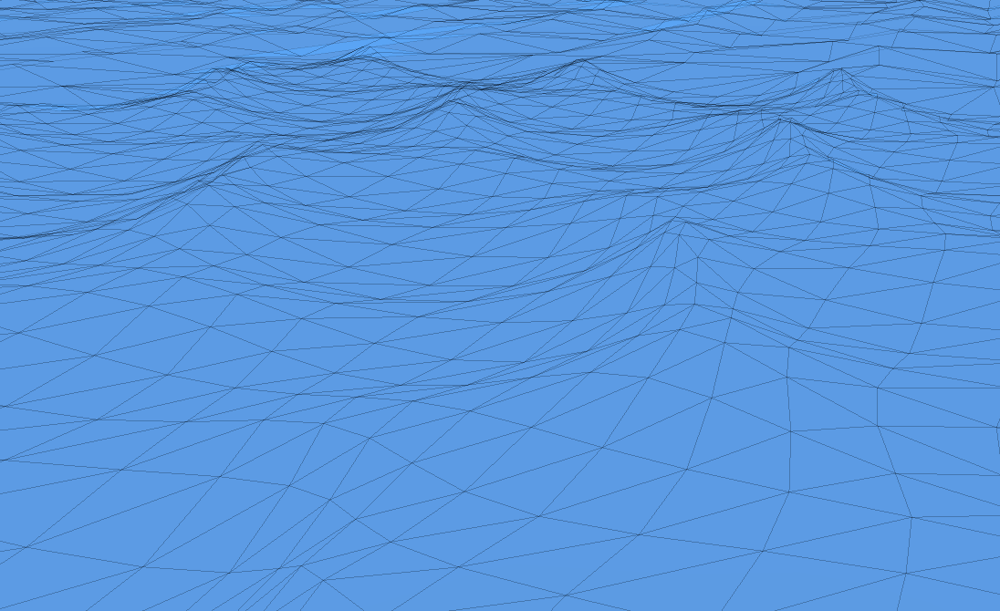

## 核心逻辑实现

首先，我们需要在顶点着色器中计算波浪的偏移。我们使用的是 **Gerstner Wave** 算法。

```hlsl
Shader "Custom/Water"
{
    Properties
    {
        [Header(Colors)]
        [MainColor] _ShallowColor("Shallow Color", Color) = (0.22, 0.66, 1.0, 1.0)
        _DeepColor("Deep Color", Color) = (0.0, 0.25, 0.45, 1.0)
        _Absorbance("Absorbance", Range(0, 10)) = 2.0
        _Roughness("Roughness", Range(0, 1)) = 0.05

        [Header(Waves and Displacement)]
        _WaveTexture("Wave Texture (R)", 2D) = "white" {}
        _WaveScale("Wave Scale", Float) = 4.0
        _HeightScale("Height Scale", Float) = 0.15
        _WaveSpeed("Wave Speed", Range(0, 0.2)) = 0.015
        _WaterViewportTexture("Water Viewport (Ripples)", 2D) = "black" {}
        _WaterSize("Water Size", Float) = 1000
        _CameraSize("Camera Size", Float) = 20
        _CameraPosition("Camera Position", Vector) = (0,0,0,0)

        [Header(Normals)]
        // 多波叠加（每个参数 xyz = 方向角, 振幅, 波长）
        _Wave1 ("波1（方向, 振幅, 波长）", Vector) = (1, 0, 0.3, 8)
        _Wave2 ("波2（方向, 振幅, 波长）", Vector) = (0.7, 0.7, 0.2, 5)
        _Wave3 ("波3（方向, 振幅, 波长）", Vector) = (-0.5, 0.866, 0.1, 3)

        _Normal1("Normal Map 1", 2D) = "bump" {}
        _Normal2("Normal Map 2", 2D) = "bump" {}
        _WaveDir1("Wave Direction 1", Vector) = (1, 0, 0, 0)
        _WaveDir2("Wave Direction 2", Vector) = (0, 1, 0, 0)
        _Refraction("Refraction", Float) = 0.01

        [Header(Foam)]
        _FoamNoise("Foam Noise", 2D) = "white" {}
        _FoamColor("Foam Color", Color) = (1, 1, 1, 1)
        _FoamAmount("Foam Amount", Range(0, 2)) = 0.2
        _FoamScale("Foam Scale", Float) = 3.0

        [Header(Caustics)]
        _CausticTexture("Caustic Array", 2DArray) = "white" {}
        _CausticSize("Caustic Size", Range(0, 8)) = 2.0
        _CausticRange("Caustic Range", Float) = 40.0
        _CausticStrength("Caustic Strength", Range(0, 2)) = 1.0
    }

    SubShader
    {
        Tags { "RenderType"="Transparent" "Queue"="Transparent" "RenderPipeline"="UniversalPipeline" }
        LOD 100

        Pass
        {
            Name "ForwardLit"
            Tags { "LightMode"="UniversalForward" }
            ZWrite On
            Blend SrcAlpha OneMinusSrcAlpha

            HLSLPROGRAM
            #pragma vertex vert
            #pragma fragment frag
            #pragma multi_compile_fog
            #include "Packages/com.unity.render-pipelines.universal/ShaderLibrary/Core.hlsl"
            #include "Packages/com.unity.render-pipelines.universal/ShaderLibrary/Lighting.hlsl"
            #include "Packages/com.unity.render-pipelines.universal/ShaderLibrary/DeclareDepthTexture.hlsl"
            #include "Packages/com.unity.render-pipelines.universal/ShaderLibrary/DeclareOpaqueTexture.hlsl"

            struct Attributes
            {
                float4 positionOS : POSITION;
                float2 uv : TEXCOORD0;
                float3 normalOS : NORMAL;
                float4 tangentOS : TANGENT;
            };

            struct v2f
            {
                float4 positionCS : SV_POSITION;
                float2 uv : TEXCOORD0;
                float3 worldPos : TEXCOORD1;
                float4 screenPos : TEXCOORD3;
                float3 normalWS : TEXCOORD4;
                float3 tangentWS : TEXCOORD5;
                float3 bitangentWS : TEXCOORD6;
                float waveHeight : TEXCOORD7;
            };

            // Uniforms
            CBUFFER_START(UnityPerMaterial)
            float4 _ShallowColor, _DeepColor, _FoamColor;
            float _Absorbance, _Roughness, _WaveScale, _HeightScale, _WaveSpeed, _Refraction;
            float4 _WaveDir1, _WaveDir2,_Wave1,_Wave2,_Wave3;
            float _FoamAmount, _FoamScale, _CausticSize, _CausticRange, _CausticStrength, _WaterSize, _CameraSize;
            float2 _CameraPosition;
            CBUFFER_END
        
            TEXTURE2D(_WaveTexture); SAMPLER(sampler_WaveTexture);
            TEXTURE2D(_Normal1); SAMPLER(sampler_Normal1);
            TEXTURE2D(_Normal2); SAMPLER(sampler_Normal2);
            TEXTURE2D(_FoamNoise); SAMPLER(sampler_FoamNoise);
            TEXTURE2D(_WaterViewportTexture); SAMPLER(sampler_WaterViewportTexture);
            TEXTURE2D_ARRAY(_CausticTexture); SAMPLER(sampler_CausticTexture);

            float3 ScreenBlend(float3 base, float3 blend) {
                return max(1.0 - (1.0 - base) * (1.0 - blend), 0.0);
            }

            
            // Gerstner 波函数
            // 输入：顶点世界坐标 xz、波方向（归一化）、振幅、波长、陡度、时间
            // 输出：顶点位移和法线贡献

            void GerstnerWave(float2 pos, float2 direction, float amplitude,float wavelength, float steepness, float time,
                                inout float3 displacement, inout float3 normal)
            {
                float k = 2.0 * PI / wavelength;         // 波数
                float c = sqrt(9.8 / k);                 // 相速度（深水波色散关系）
                float2 d = normalize(direction);
                float f = k * (dot(d, pos) - c * time); // 相位

                float Q = steepness / (k * amplitude);   // 归一化陡度

                displacement.x += Q * amplitude * d.x * cos(f);
                displacement.z += Q * amplitude * d.y * cos(f);
                displacement.y += amplitude * sin(f);

                // 法线贡献
                normal.x -= d.x * k * amplitude * cos(f);
                normal.z -= d.y * k * amplitude * cos(f);
                normal.y -= Q * k * amplitude * sin(f);
            }


            v2f vert(Attributes input)
            {
                v2f OUT;
/*
                VertexPositionInputs vertexInput = GetVertexPositionInputs(input.positionOS.xyz);
                output.worldPos = vertexInput.positionWS;
                
                // 波浪计算
                float2 waveUV = output.worldPos.xz / _WaveScale * 0.15 + _Time.y * _WaveSpeed;
                output.waveHeight = SAMPLE_TEXTURE2D_LOD(_WaveTexture, sampler_WaveTexture, waveUV, 0).r - 0.5;
                
                float3 displacedPos = input.positionOS.xyz;
                displacedPos.y += output.waveHeight * _HeightScale;
                
                output.positionCS = TransformObjectToHClip(displacedPos);
                output.screenPos = ComputeScreenPos(output.positionCS);
                output.uv = input.uv;

                VertexNormalInputs normalInput = GetVertexNormalInputs(input.normalOS, input.tangentOS);
                output.normalWS = normalInput.normalWS;
                output.tangentWS = normalInput.tangentWS;
                output.bitangentWS = normalInput.bitangentWS;

                return output;
*/
                // 获取世界坐标
                float3 worldPos = TransformObjectToWorld(input.positionOS.xyz);
                float time = _Time.y; // Unity 内置时间（等价 ShaderToy 的 iTime）

                // 累积多个 Gerstner 波的位移
                float3 displacement = float3(0, 0, 0);
                float3 normalOffset = float3(0, 0, 0);

                float _WaveSteepness = 0.5;
                GerstnerWave(worldPos.xz, _Wave1.xy, _Wave1.z * _HeightScale, _Wave1.w *_WaveScale, 
                             _WaveSteepness, time * _WaveSpeed, displacement, normalOffset);

                GerstnerWave(worldPos.xz, _Wave2.xy, _Wave2.z * _HeightScale, _Wave2.w *_WaveScale, 
                             _WaveSteepness * 0.8, time * _WaveSpeed * 1.1, displacement, normalOffset);

                GerstnerWave(worldPos.xz, _Wave3.xy, _Wave3.z * _HeightScale, _Wave3.w * _WaveScale, 
                             _WaveSteepness * 0.5, time * _WaveSpeed * 1.3, displacement, normalOffset);

                worldPos += displacement;

                // 计算世界空间法线

                float _NormalScale = 0.5;
                float3 worldNormal = normalize(float3(
                    normalOffset.x * _NormalScale,
                    1.0 - normalOffset.y * _NormalScale,
                    normalOffset.z * _NormalScale
                ));
                // 4. 重构切线与副切线 (TBN Reconstruction)
                // 因为顶点发生了位移，需要手动计算一个切线方向。
                // 通常取 (1, 0, 0) 与法线做叉乘来获得参考切线
                float3 tangentWS = normalize(float3(1.0 - worldNormal.y * worldNormal.y, worldNormal.x * -worldNormal.y, -worldNormal.z * worldNormal.y));
                if (abs(worldNormal.y) > 0.99) tangentWS = float3(1, 0, 0); // 处理极点情况
                float3 bitangentWS = cross(worldNormal, tangentWS);


                OUT.positionCS = TransformWorldToHClip(worldPos);
                OUT.worldPos = worldPos;

                OUT.normalWS = worldNormal;
                OUT.tangentWS = tangentWS;
                OUT.bitangentWS = bitangentWS;


                OUT.uv = input.uv;
                OUT.screenPos = ComputeScreenPos(OUT.positionCS);
                OUT.waveHeight = displacement.y;

                return OUT;

            }

            half4 frag(v2f i) : SV_Target
            {
                float2 screenUV = i.screenPos.xy / i.screenPos.w;
                float3 viewDir = normalize(GetWorldSpaceViewDir(i.worldPos));
                

                float3 albedo = _ShallowColor.rgb;
              
                float3 finalRGB = albedo;
                return half4(finalRGB, 0.8);
            }
            ENDHLSL
        }
    }
}
```

效果如下
