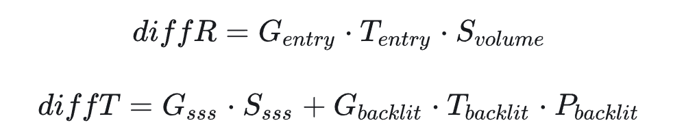

## 核心逻辑

参考了经典的 GGX 微表面 BRDF，两者都将光照分解为几个物理项的乘积:
S (散射光，光的分布/散射量),
G (入射几何项，入射光的有效投影),
T (菲涅尔透射，界面反射/透射比例)

水体散射公式如下


和常规GGX的共同点：

都用几何项 G 表示入射光的有效投影面积；
都用菲涅尔项 F/T 处理界面的能量分配；
都将复杂光照分解为可独立计算的物理项相乘；

特殊点在于：
GGX 处理的是表面微观几何的反射，
水体 BSDF 处理的是体积介质的散射和透射，水体需要区分反射方向 (diffR) 和透射方向 (diffT)

## 输入参数
相比 GGX BRDF（只需要 roughness 和 fresnel0），水体 BSDF 需要额外的体积散射参数：


scatterColor	float3	[0, ∞)	散射系数 μs，决定光被散射的强度和颜色  
absorptionColor	float3	[0, ∞)	吸收系数 μa，决定光被吸收的强度和颜色    
thickness	float	[0, 1]	归一化厚度，0=极薄（波峰），1=最厚（深水边界）  
fresnel0	float	~0.02	水的菲涅尔基础反射率  
_PhaseG	float	[-1, 1]	HG 相位函数的 g 值，水体典型值 0.8（前向散射）  
RayStart	float3	射线起点（水面位置）  
RayEnd	float3	射线终点（折射后的水下位置）  
SceneColor	float3	水下场景颜色（用于场景散射，可选）  
shadowValue	float	阴影值（可选）  
消光系数（absorptionColor + scatterColor）  
散射反照率（决定吸收/散射比例）  
光学深度（决定介质的”不透明度”）  

## 概述
光进入水中后会被吸收和散射，部分光在水体内部多次弹射后从表面出射回到摄像机。这个过程涉及：入射折射、体积散射、出射透射三个阶段。  
Step 1: 入射计算 计算三个入射几何项（G_entry、G_sss、G_backlit）和入射菲涅尔透射（T_entry），决定多少光进入水体、进入哪个散射路径。  
Step 2: 体积散射 (diffR) 对深水区域进行少量 ray marching，累加多次散射的光量，输出 S_volume。  
Step 3: 薄层 SSS (diffT 的一部分) 对薄层区域计算散射光量 S_sss，使用非线性光程修正处理不同厚度，并与深水散射混合。  
Step 4: 背光透射 (diffT 的一部分) 计算光从背面穿透薄层的透射光，使用极强前向相位函数。  
Step 5: 出射透射 所有散射光经过出射菲涅尔透射 T_exit 后到达摄像机。  

最终输出：
```hlsl
diffR = G_entry × T_entry × S_volume
diffT = (G_sss × S_sss) + (G_backlit × T_backlit × P_backlit)
output = (diffR + diffT) × T_exit
```
