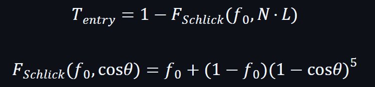
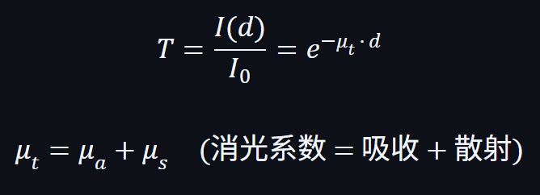
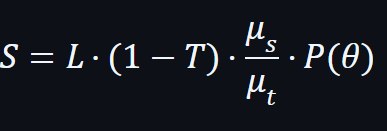

## 核心逻辑

菲涅尔透射 (Fresnel Transmission)：光在界面上一部分被反射，剩余部分透射进入水中。透射比例由菲涅尔方程决定。
公式：


entry,sss,backlit3者有各自有独立的入射几何项，根据 NdotL 的正负自然分配能量，避免重复计算。
```hlsl
float G_entry = clampedNdotL;      // Line 204
float G_sss = 1.0 - G_entry;       // Line 309
float G_backlit = saturate(-NdotL); // Line 375
```
分工如下：  
正面（NdotL > 0）：大部分光穿过薄层进入深水，由 diffR 处理
侧面（NdotL ≈ 0）：diffR 无贡献，薄层散射 thinLayerSSS 主导
背面（NdotL < 0）：光从背后入射，thinLayerSSS 和 backlitTransmission 共同作用
基本参数可以直接算出

```hlsl
float G_entry;
float3 T_entry;
float3 S_volume;

float NdotL = dot(N, L); 
G_entry = saturate(NdotL); //正面受光时大，侧面趋近 0，背光直接 0。
float G_sss = 1.0 - G_entry;       // 薄层散射 thinLayerSSS 主导
float G_backlit = saturate(-NdotL); // 光从背后入射，thinLayerSSS 和 backlitTransmission 共同作用

float fresnel0 = 0.2; // 等修改
T_entry = 1.0 - F_Schlick(fresnel0, G_entry);
```

深水区域使用 ray marching 沿视线采样，累加每一步的散射光量。循环次数默认6次。  
Beer-Lambert透射：用于表示光在介质中传播时按指数衰减。
  
散射光计算：被消光的光中，一部分被吸收（变成热量），另一部分被散射（改变方向）。
  
从左到右分别为：入射光，被消光的比例（积分结果），散射反照率（被消光的光中有多少是散射而非吸收），散射光中朝向摄像机的比例

```hlsl```